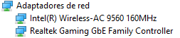
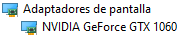
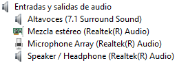
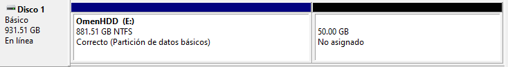
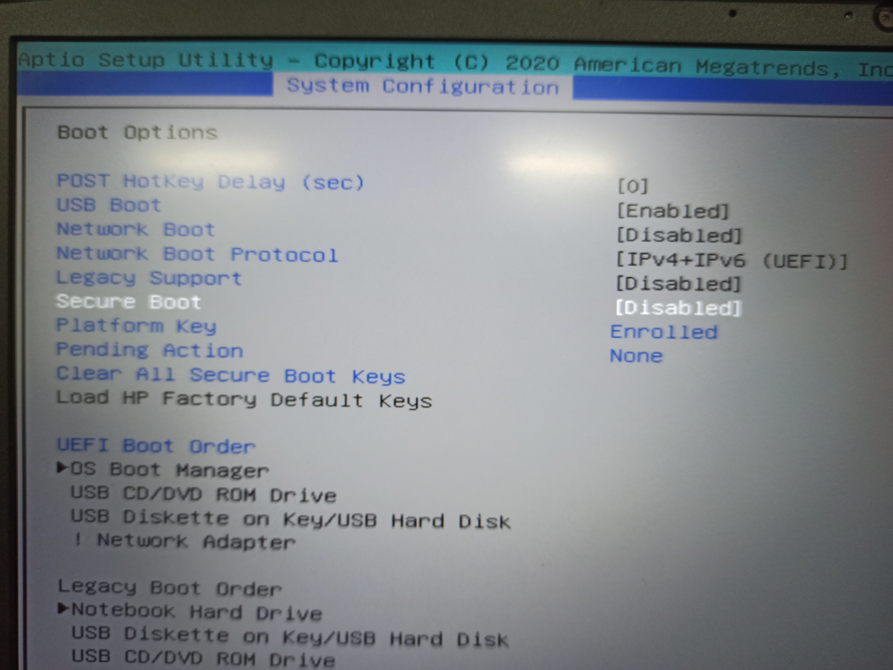

# admin-serv

Primera actividad: Checklist para la instalación de Debian.

Checklist para la instalación de Linux mediante dual boot.

### Antes de la instalación

**Anotar los dispositivos de hardware de la PC para su compatibilidad con el SO por instalar.**

---

- Tarjeta de red
    - Intel(R) Wireless-AC 9560 160MHz
    - Realtek Gaming GbE Family Controller
        
        
        
- Tarjeta de video
    - NVIDIA GeForce GTX 1060
        
        
        
- Tarjeta de audio
    - Realtek
        
        
        

**Revisar el particionamiento de los discos.**

---

- Captura de pantalla antes de ser modificados
    
    
    
- Tipo de modificación y plan de particiones
    - De un HDD hacer una reducción de 50Gb para dedicarlos a linux completamente.
- Muestra del resultado una vez hechas las modificaciones
    
    
    

**Verificar tener el *Secure Boot* desactivado desde la BIOS.**

---

### Durante la instalación

Revisar constantemente la conexión a internet para no alterar la descarga de paquetes.

### Después de la instalación

Verificar la completa integridad de los paquetes y comprobar que los paquetes estén completamente actualizados
